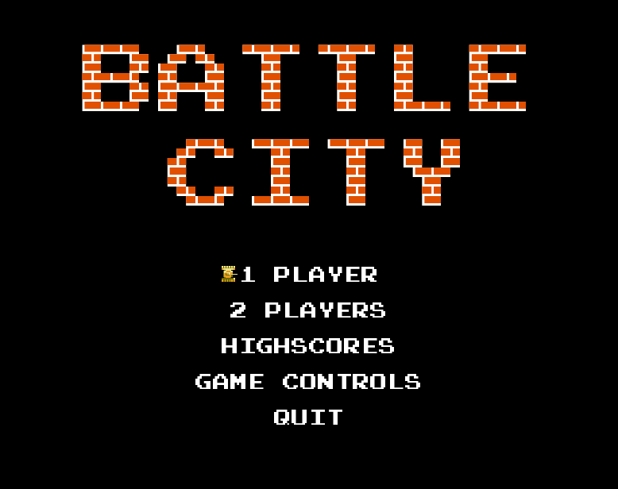
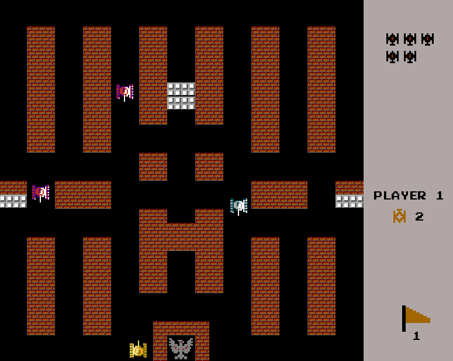

# Battle City Allegro

Game inspired on the classic shooter [Battle City](https://en.wikipedia.org/wiki/Battle_City) published on 1985.

## Requirements

* Allegro 5

On Debian and Debian based distros such as Ubuntu and Linux Mint:

    $ sudo apt install liballegro5-dev

## Install

The first step is clone this repository:

    $ git clone https://github.com/LucasNolasco/BattleCityAllegro.git

Then, enter the created folder and compile the code:

    $ cd BattleCityAllegro

    $ make all

Finally, for run just type:

    $ ./BattleCity

